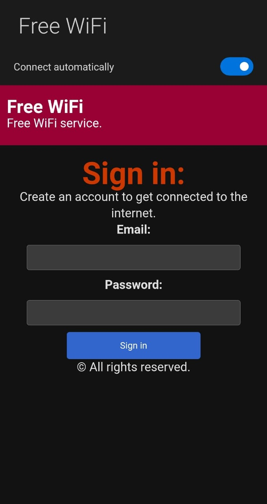
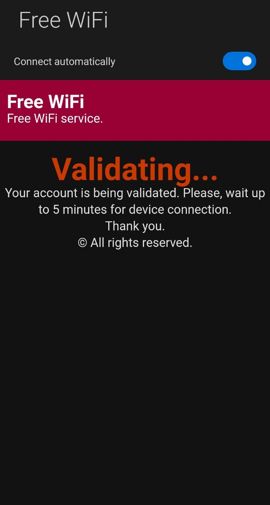

# **WiFiGate - ESP8266 Captive Portal**

🚀 **WiFiGate** is a lightweight, customizable captive portal built for the ESP8266 using LittleFS. This project allows you to create a WiFi hotspot that captures user credentials (email and password) through a simple and modern web interface.

---

## 🎯 **Features**

- 🌐 **Captive Portal**: Automatically redirects users to a custom login page upon connection.
- 🔐 **Credential Capture**: Collects and securely stores user credentials locally.
- 📁 **File Management**: Leverages **LittleFS** for data storage and management.
- 💡 **Blink Indicator**: Visual feedback via the ESP8266 onboard LED when credentials are received.
- 🎨 **Customizable UI**: Easily update the portal's design, title, and messages.
- 🔄 **Reset Functionality**: Clear saved credentials directly from the web interface.

---

## 📋 **Setup Instructions**

### **Hardware Requirements**
- **ESP8266 Development Board** (e.g., NodeMCU, Wemos D1 Mini)
- USB Cable
- Microcontroller Programming Environment (e.g., Arduino IDE)

### **Software Requirements**
- Arduino IDE (with ESP8266 Board Manager installed)
- ESP8266 LittleFS File System Plugin

---

### **Step 1: Install Dependencies**

1. Install the ESP8266 Board Package in Arduino IDE.
   - Go to **File > Preferences**, and add the following URL under "Additional Board Manager URLs":
     ```
     http://arduino.esp8266.com/stable/package_esp8266com_index.json
     ```
   - Open **Tools > Board > Boards Manager**, search for "ESP8266", and install the package.

2. Install the following Arduino libraries:
   - **ESP8266WiFi.h**
   - **DNSServer.h**
   - **ESP8266WebServer.h**
   - **LittleFS.h**

---

### **Step 2: Upload the Code**

1. Clone this repository:
   ```bash
   git clone https://github.com/Jyothish9988/WiFiGate.git
   cd WiFiGate
   ```

2. Open `WiFiGate.ino` in the Arduino IDE.

3. Modify the user configuration section at the top of the code if needed:
   ```cpp
   #define SSID_NAME "Free WiFi"
   #define SUBTITLE "Free WiFi service."
   #define TITLE "Sign in:"
   ```

4. Select your ESP8266 board and upload the code.

---

### **Step 3: Flash LittleFS Data**

1. Use the **LittleFS Data Upload Tool** to flash the filesystem:
   - Download the plugin from [here](https://github.com/esp8266/arduino-esp8266littlefs-plugin/releases).
   - Copy it to the `tools` folder in your Arduino installation directory.
   - Place your `SavedFile.txt` into the **data/** folder and upload it via **Tools > ESP8266 LittleFS Data Upload**.

---

## 💻 **Usage**

1. Power on the ESP8266.
2. Connect to the WiFi network named `Free WiFi` (or the name you configured).
3. You will be redirected to the captive portal login page.
4. Enter an email and password to submit credentials.
5. Access stored credentials:
   - Visit `/creds` to view the list of captured credentials.
   - Use `/clear` to delete all stored credentials.

---

## 🛠️ **Customization**

You can personalize the following sections in the code:
- **Portal UI**: Update titles, messages, and styles in the `header()` and `index()` functions.
- **LED Feedback**: Customize the blinking pattern in the `BLINK()` function.
- **Credential Storage**: Modify how data is saved in `writeData()` and `readData()`.

---

## 🤖 **Future Enhancements**

- 🔒 Add encryption for credentials stored in LittleFS.
- 📡 Implement cloud integration to sync credentials remotely.
- 📱 Develop a mobile-friendly responsive interface.

---

## 🌟 **Screenshots**

| Login Page                           | Credentials Page                      |
|--------------------------------------|---------------------------------------|
|  |  |

---

## 🤝 **Contributing**

Contributions are welcome! Here's how you can help:
1. Fork the repository.
2. Create a new branch: `git checkout -b feature-name`.
3. Commit your changes: `git commit -m 'Add some feature'`.
4. Push to the branch: `git push origin feature-name`.
5. Submit a pull request.

---

## 📜 **License**

This project is licensed under the [MIT License](LICENSE). Feel free to use and modify it for your own purposes.

---

## 🧑‍💻 **Author**

Developed by **[Jyothish S L](https://github.com/JyothishSL)**.  
Inspired by **[125K](https://github.com/125K)**.  

---

## 🛠️ **Acknowledgments**

Special thanks to:
- [ESP8266 Community](https://esp8266.com/) for their incredible resources.
- [Arduino](https://www.arduino.cc/) for their amazing platform.

---

Let me know if you'd like to adjust any specific sections! 🚀
